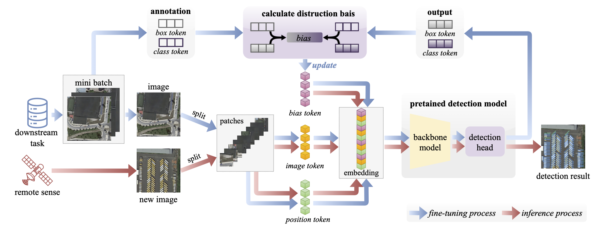

# DBET

This is an implementation of the DBET method, described in the following paper:

**Distribution Bias Embedding-based Tuning Method in Vision Transformer for Remote Sensing Object Detection**

## Abstract

The increasing availability of remote sensing data has sparked a growing demand for advanced object detection methods to support Earth observation applications. Vision Transformers (ViTs) have recently emerged as a powerful backbone for visual recognition, achieving exceptional performance across various tasks. However, adapting pretrain ViT models to specific downstream tasks, especially in remote sensing, presents challenges due to distribution different between pretrain and downstream task datasets. In this paper, we introduce the Distribution Bias Embedding-based Tuning (DBET) method, which effectively addresses this issue by introducing a bias token mechanism that aligns the feature distribution of pretrain models with that of downstream tasks.  Our method reduces the number of parameters requiring fine-tuning, significantly improving computational efficiency and reducing training time. Experimental evaluations on benchmark datasets such as DOTA-v1.0, RarePlanes, and EAGLE demonstrate that DBET not only reduces trainable parameters and accelerates training but also significantly improves accuracy, especially on tasks with a limited number of categories. DBET's ability to adapt ViT models without modifying their backbone architecture makes it a valuable approach for remote sensing object detection tasks.

## Requirements

- Python 3.8
- MMdetection 2.2
- For other dependencies, see [requirements.txt](./requirements.txt)
